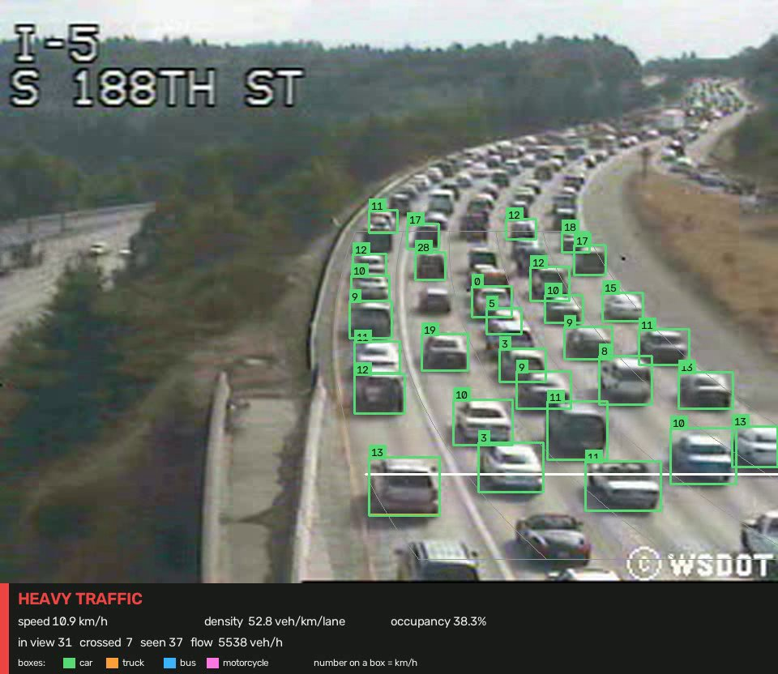
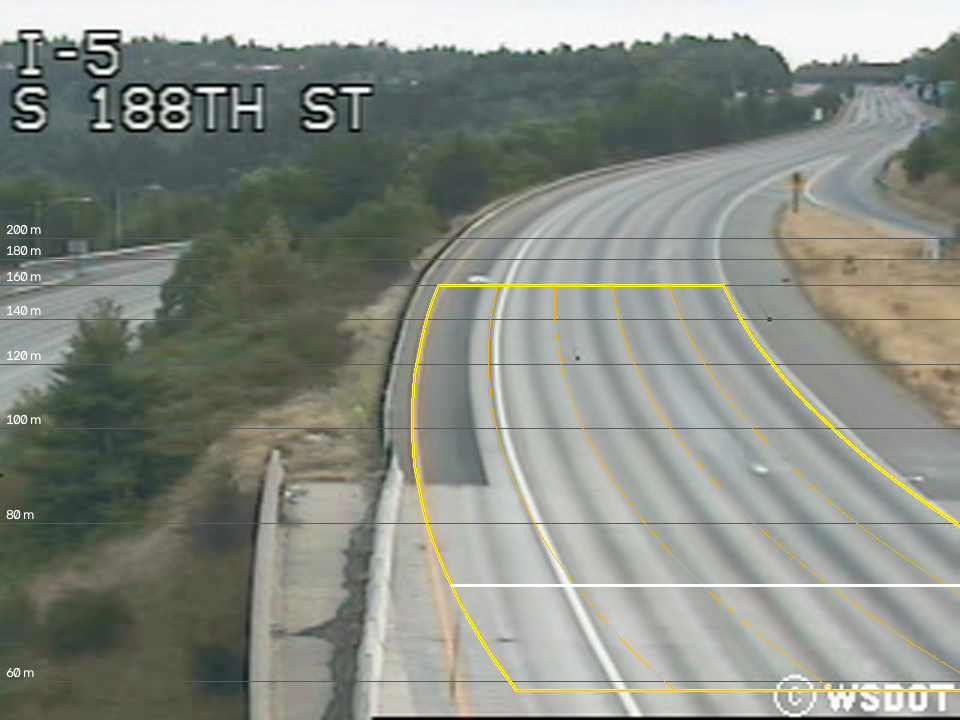

# Highway Traffic Vision

Measures traffic from ordinary highway camera video. It finds every vehicle, follows it
through the clip, and works out how many there are, how fast they are going, how tightly
packed they are and which lanes they use. From those measurements it decides whether the
road is flowing freely, slowing, or jammed.

[](LICENSE)




*Heavy traffic on I-5 southbound, Seattle. Box colour is the vehicle type, the number on
each box is its speed in km/h, and the panel underneath is the clip's summary.*

---

## Results at a glance

Tested on 254 clips from the UCSD traffic database, using the four evaluation splits the
dataset ships with, so every clip was scored by a model that had never seen it.

| | |
|---|---|
| **Congestion level called correctly** | **95.3%** (±1.5 across the four splits) |
| Always answering "light", for comparison | 65.0% |
| Macro-F1 — scores light, medium and heavy equally | 0.918 |
| Vehicles tracked across the dataset | 4,717 |

What was measured, as medians per level:

| | light | medium | heavy |
|---|---|---|---|
| speed | 90 km/h | 42 km/h | 22 km/h |
| density (vehicles per km per lane) | 6.4 | 31.5 | 38.0 |
| road area covered by vehicles | 4% | 20% | 31% |
| flow past the counting line (vehicles/hour) | 3,062 | **7,157** | 5,127 |

The full write-up — charts, traffic findings, recommendations, and how far to trust each
number — is in **[RESULTS.md](RESULTS.md)**.

---

## What it measures

| Parameter | Unit | How |
|---|---|---|
| Vehicle count, by type | vehicles | every vehicle tracked through the clip; car, truck, bus, motorcycle |
| Vehicles passing a point | vehicles, and vehicles/hour | tracks that cross a fixed counting line |
| Speed | km/h | fitted to each vehicle's whole path on a pixels-to-metres map of the road |
| Density | vehicles per km per lane | vehicles on the measured stretch, averaged over every frame |
| Occupancy | % of road area | share of the road covered by vehicle boxes |
| Lane use | per lane | which lane is busiest, and how evenly the lanes are loaded |
| Lane changes | per vehicle | a vehicle must hold its new lane for two frames to count |
| Congestion level | light / medium / heavy | a classifier reading the measurements above |

---

## Quick start

### 1. Install

Needs Python 3.11 or newer. A GPU is optional but strongly recommended: analysing the
whole dataset took 30 minutes on a laptop GPU (Quadro RTX 5000 Max-Q).

```bash
git clone https://github.com/abdullahabuslama/highway-traffic-vision.git
cd highway-traffic-vision

python -m venv .venv
source .venv/bin/activate          # Windows: .venv\Scripts\activate

# PyTorch first, from the index matching your GPU driver. Skip this line to run on CPU.
pip install torch torchvision --index-url https://download.pytorch.org/whl/cu126

pip install -e .
```

For the exact versions this was built and tested with, use `pip install -r requirements.txt`
instead of `pip install -e .`. The first run downloads the YOLO detector weights, about 19 MB.

### 2. Get the dataset

The videos are not included in this repository — see [Data and credits](#data-and-credits).
Download the **UCSD Highway Traffic Videos** dataset from
[Kaggle](https://www.kaggle.com/datasets/aryashah2k/highway-traffic-videos-dataset) and
unzip it into a folder called `dataset/` at the root of the repository:

```bash
unzip archive.zip -d dataset
```

The code reads these, and ignores everything else in the download:

```
dataset/
  ImageMaster          the label of each clip
  info.txt             date, time and weather of each clip
  EvalSet_train        which clips train each of the four test splits
  EvalSet_test         which clips test each split
  video/               the 254 .avi clips
```

### 3. Analyse a clip

```bash
traffic-flow analyse dataset/video/cctv052x2004080613x00015.avi --quiet
```

```
cctv052x2004080613x00015: light traffic - 21 vehicles, 77 km/h, 18 veh/km/lane, 9% occupancy
```

A road with no traffic says so. Reporting 0 km/h would read as a standstill — the opposite
of an empty road:

```
cctv052x2004080607x01844: light traffic - 0 vehicles, no traffic, 0 veh/km/lane, 0% occupancy
```

Add `--annotate outputs/clip.mp4` to also write the annotated video.

---

## Usage

### Command line

```bash
traffic-flow analyse <clip>                       # full result as JSON, then a summary line
traffic-flow analyse <clip> --quiet               # summary line only
traffic-flow analyse <clip> --annotate out.mp4    # also write an annotated video
traffic-flow analyse <clip> --out result.json     # also save the JSON to a file
traffic-flow serve --port 8000                    # start the HTTP API
```

`--camera`, `--pipeline` and `--model` point at other config files or another trained model.

### HTTP API

```bash
traffic-flow serve
```

Interactive documentation, generated from the code, is served at
<http://127.0.0.1:8000/docs>.

| Method | Path | What it does |
|---|---|---|
| `GET` | `/health` | whether the service is ready, and whether a trained model is loaded |
| `POST` | `/analyse` | upload a clip as the form field `clip`; returns its traffic parameters |
| `POST` | `/analyse?annotate=true` | the same, and also renders an annotated video |
| `GET` | `/analyse/{request_id}/video` | download the annotated video from that request |

```bash
curl -F "clip=@dataset/video/cctv052x2004080516x01646.avi" \
     "http://127.0.0.1:8000/analyse?annotate=true"
```

The response, trimmed:

```json
{
  "clip_id": "cctv052x2004080516x01646",
  "duration_s": 5.2,
  "measured_over": { "road_length_m": 101.3, "lanes": 5 },
  "counts": {
    "vehicles_seen": 37,
    "crossed_the_line": 8,
    "by_class": { "car": 36, "truck": 1, "bus": 0, "motorcycle": 0 },
    "flow_veh_per_hour": 5538.0
  },
  "speed": { "space_mean_kph": 10.9, "median_kph": 11.2, "vehicles_measured": 37 },
  "density": { "veh_per_km_per_lane": 52.8, "occupancy": 0.383 },
  "lanes": { "busiest": "lane_3", "lane_changes": 3 },
  "congestion": { "level": "heavy", "confidence": 0.9990921377241004, "source": "model" },
  "annotated_video_url": "/analyse/ae9467deb70742a4a1d820138adf9f8d/video"
}
```

A speed that could not be measured, because the road was empty, comes back as `null`.

| Status | Meaning |
|---|---|
| `400` | the request id is malformed |
| `404` | no annotated video for that request id |
| `415` | not a video file — accepted: `.avi` `.mp4` `.mov` `.mkv` `.m4v` |
| `422` | the video could not be read |
| `503` | the service is still loading the detector |

### From Python

```python
from traffic_flow.service import TrafficService

service = TrafficService.build()        # loads the detector and model once
result = service.analyse("dataset/video/cctv052x2004080516x01646.avi")
print(result["congestion"]["level"], result["speed"]["space_mean_kph"])
```

The command line and the API are both thin wrappers over this one call, so all three
always report the same numbers.

---

## Reproducing the results

The repository already contains the trained model and the analysed features, so steps 3–5
run in seconds and need no GPU. They still need the dataset downloaded, because the clip
labels and the evaluation splits come from it. Steps 1–2 regenerate the features from the
raw videos.

| Step | Command | Writes | Time |
|---|---|---|---|
| 1 | `python scripts/calibrate_camera.py` | `config/camera_i5.yaml` | several minutes |
| 2 | `python scripts/run_dataset.py` | `outputs/clip_features.parquet` | ~30 min on a GPU |
| 3 | `python scripts/evaluate.py` | `outputs/evaluation*.csv` | seconds |
| 4 | `python scripts/train_model.py` | `models/congestion_model.pkl` | seconds |
| 5 | `python scripts/build_report.py` | `outputs/figures/` | seconds |
| 6 | `python scripts/render_demos.py` | `outputs/demos/` | about a minute |

Every script takes `--dataset <path>` if the videos live somewhere other than `dataset/`.

---

## How it works

```
 clip ──▶ detect vehicles ──▶ keep what is on the road ──▶ track ──▶ record
                                                                      │
                             ┌────────────────────────────────────────┤
                             ▼            ▼             ▼             ▼
                          counts       speed        density       lane use
                             └────────────┴─────────────┴─────────────┘
                                                │
                                        congestion level
```

**Detection.** YOLO11s, pretrained on the COCO image set, which already knows car, truck,
bus and motorcycle. The dataset has no bounding boxes to train on, so the work went into
running the pretrained detector well. The setting that matters most is input size. The
frames are 320×240, where a car near the horizon is about ten pixels across — too small to
detect at native size. Enlarging each frame before detection makes those vehicles visible:

| input size | 640 | 960 | **1280** | 1600 |
|---|---|---|---|---|
| vehicles found per frame | 11 | 17 | **19** | 13 |

Larger models were tried and rejected. On the same frames YOLO11s found 687 on-road
vehicles and YOLO11l found 713 — 4% more, for four times the run time.

**Tracking.** ByteTrack, loosened for 10 frames per second. At that rate a motorway vehicle
moves nearly three metres between frames, so its box barely overlaps its own position in
the next frame. ByteTrack also keeps low-confidence detections for a second matching pass,
which matters here: a distant car is often detected weakly for a few frames, and a stricter
tracker would split it into two short vehicles.

**Speed.** Fitted to each vehicle's whole path, not measured frame to frame. Boxes wobble
by a pixel or two, and far down the road one pixel is several metres; because a distance
is always positive, that wobble never cancels out and would show a parked car as moving.
The fit uses the Theil-Sen estimator, the median slope over every pair of points, which
averages the wobble away and ignores the odd wild point.

The clip's speed is the **space mean speed**: total distance covered by all vehicles,
divided by the total time they spent covering it. A plain average of the vehicles' speeds
would flatter a failing road, because fast vehicles stream past while slow ones sit there.

**Density** comes from the frames rather than the tracks. Each frame is a snapshot of how
many vehicles were on the measured stretch; the average over frames, divided by the
stretch's length, gives vehicles per kilometre per lane. **Occupancy** is reported beside it
as a second opinion. It needs only boxes, not identities, so it still carries signal when
tracking struggles.

**Congestion level** is the only learned step. Fifteen measurements per clip go into a
logistic regression — 48 learned numbers in total. With about 190 training clips per split,
anything larger would memorise them. And because the inputs are traffic measurements, the
model can be read: faster speed pushes a clip towards "light", higher occupancy towards
"heavy". A gradient-boosted model was scored alongside it and did worse (93.7%).

---

## Camera calibration

Turning pixels into metres needs a model of the camera, and the dataset says nothing about
it. Everything is measured from the video instead; nothing is drawn by hand.

Adding up how much each pixel changes between frames, over 60 clips, makes the lanes appear
as bright bands, because that is where vehicles pass. That finds the **five lanes** far more
reliably than the painted markings, which are worn and barely visible at this resolution.

A camera on a pole looking at a flat road is described by three numbers:

| | value | where it comes from |
|---|---|---|
| horizon position | image row 16.1 | how apparent motion grows down the frame (fit quality 0.978) |
| camera height | 15.9 m (52 ft) | lane spacing, given 3.66 m US interstate lanes |
| focal length (zoom) | 797 px | **assumed** — see below |

A vehicle at steady speed covers the same metres every frame but not the same pixels: it
crawls across the far end of the picture and races across the near end. The camera model
says the square root of that pixel step rises in a straight line down the image, crossing
zero at the horizon. Forty-nine thousand measurements fit that line with a quality of
0.978, which is also the check that the flat-road model suits this camera.

**The zoom cannot be measured, and it is the one real assumption in the project.** Nothing
in a picture of a road reveals it unless something of known length lies *along* the road.
The lane dashes would do — they repeat every 12.2 m — but a search for that repeat across
all four lane boundaries found nothing at this resolution. So the zoom is set from what
the dataset does say: `light` clips are free-flowing traffic, which on this road, signed at
60 mph, is about 100 km/h.

**What that means.** Absolute speeds scale with that one choice, and densities scale the
opposite way. Nothing else depends on it: which clip is faster than which, the shape of the
speed–density curve, and every classification result are unchanged.



The result is a 23° field of view watching a 101 m stretch of road, 59 m to 160 m from the
camera. A 52 ft pole with a zoomed lens is what a highway surveillance camera typically is,
which is the sanity check that the numbers are plausible.

To use a different camera, run `scripts/calibrate_camera.py` on its footage first. The
numbers above are specific to this one.

---

## Configuration

Nothing in the code hard-codes a threshold. Everything tunable lives in two files:

| File | Holds | Change it when |
|---|---|---|
| [config/pipeline.yaml](config/pipeline.yaml) | detector model and input size, confidence threshold, tracker settings | tuning detection or tracking |
| [config/camera_i5.yaml](config/camera_i5.yaml) | road outline, lane shapes, counting line, pixels-to-metres points | **written by the calibration script** — recalibrate rather than editing by hand |

Each setting in `pipeline.yaml` carries a comment saying why it has the value it does.

---

## Project layout

```
config/                     tunable settings, and this camera's calibration
models/                     the trained congestion classifier
outputs/                    figures, demo videos, and the analysed features
scripts/                    calibrate, run, evaluate, train, report, render demos

src/traffic_flow/
  pipeline.py               the one file that knows the whole order of events
  service.py                analyse one clip, return plain data - the single entry point
  cli.py  api.py            the two front ends, both thin wrappers over service.py

  data/catalog.py           reads the dataset's index files into one table
  io/video_source.py        frame reader; skips the dataset's corrupted first frame
  detection/                the detector interface, and YOLO behind it
  tracking/                 ByteTrack, and what is remembered per clip
  geometry/                 pixels to metres, the road outline, and the calibration maths
  metrics/                  counting, speed, density, lane use - one file each
  aggregate/                one clip -> one row of fifteen numbers
  classify/                 rule model, learned model, baseline, and the scoring
  viz/                      the annotated video and the report charts

tests/                      61 tests
```

The pipeline talks to the detector only through an interface
([detection/base.py](src/traffic_flow/detection/base.py)), so a different detector drops in
as one new file without changes anywhere else.

---

## Testing

```bash
pip install -e ".[dev]"
pytest
```

61 tests, no GPU needed. Six of them read the real videos and are skipped when `dataset/`
is absent.

---

## Limitations

**Only the congestion level can be checked against ground truth.** The dataset labels each
clip light, medium or heavy, and nothing else — no boxes, no speeds, no camera survey. So
counts, speeds and densities are measured but cannot be scored; the classification is.

**Vehicles are undercounted in queued traffic.** Against counts made by eye on four frames,
light and medium traffic matched closely (10 against 11, and 30 against 30), but a heavy
queue gave 27 against 38. Stopped vehicles overlap and get merged or missed, so density is
understated exactly where the road is worst. Speed is what identifies the heavy clips.

**Flow per hour is noisy.** Each clip is about five seconds, so an hourly rate rests on a
handful of crossings. Density and occupancy, averaged over every frame, are steadier.

**Vehicle types are approximate.** COCO's "truck" includes pickups and large vans, so the
truck count is not a freight count. No motorcycles were detected in any clip; at 320×240
they are only a few pixels wide.

**Rain and lens water hurt.** Clips with water on the lens are 5% of the dataset but a third
of the classification errors.

**The calibration is for one camera.** Footage from anywhere else is measured against the
wrong road until `scripts/calibrate_camera.py` has been run on it.

---

## Data and credits

The videos come from the **UCSD Traffic Database**, collected by the Statistical Visual
Computing Lab at the University of California, San Diego. The footage is from a Washington
State Department of Transportation camera on I-5 southbound at S 188th St, Seattle,
recorded over two days in August 2004.

- Original source: <http://www.svcl.ucsd.edu/projects/traffic/>
- Download mirror: <https://www.kaggle.com/datasets/aryashah2k/highway-traffic-videos-dataset>

The dataset's authors ask that it be cited as:

> A. B. Chan and N. Vasconcelos, "Probabilistic Kernels for the Classification of
> Auto-Regressive Visual Processes", *Proceedings of the IEEE Conference on Computer Vision
> and Pattern Recognition (CVPR)*, San Diego, 2005.

The original dataset states no licence, so it is not redistributed here. **The demo
videos, the preview image and the calibration overlay contain frames of that footage.**
They are included to show the results, with credit to UCSD and WSDOT, and are not covered by
this repository's licence.

Vehicle detection uses [Ultralytics YOLO](https://github.com/ultralytics/ultralytics) and
tracking uses [Roboflow Trackers](https://github.com/roboflow/trackers).

---

## License

Copyright (C) 2026 Abdullah Abuslama.

Released under the **GNU Affero General Public License v3.0 or later** — see
[LICENSE](LICENSE).

AGPL is used because Ultralytics YOLO, which does the vehicle detection, is itself AGPL-3.0;
every other dependency uses a permissive licence. In short: you may use, change and share
this code, but if you distribute it, or run it as a service for others, you must publish your
source under the same licence. That applies to this project in particular because it
includes a web API.

The licence covers the code only. See [Data and credits](#data-and-credits) for the dataset
and the footage in the demo files.
