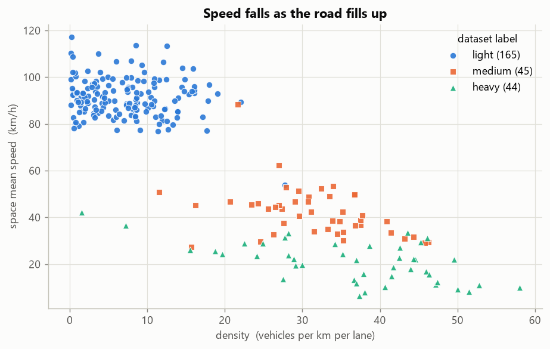
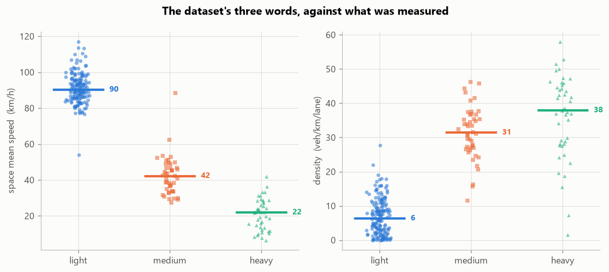
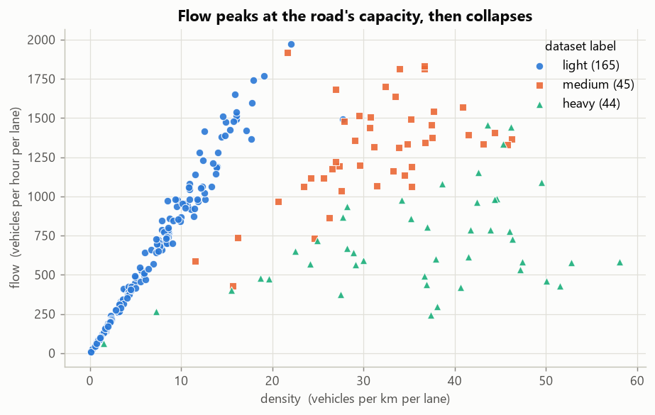
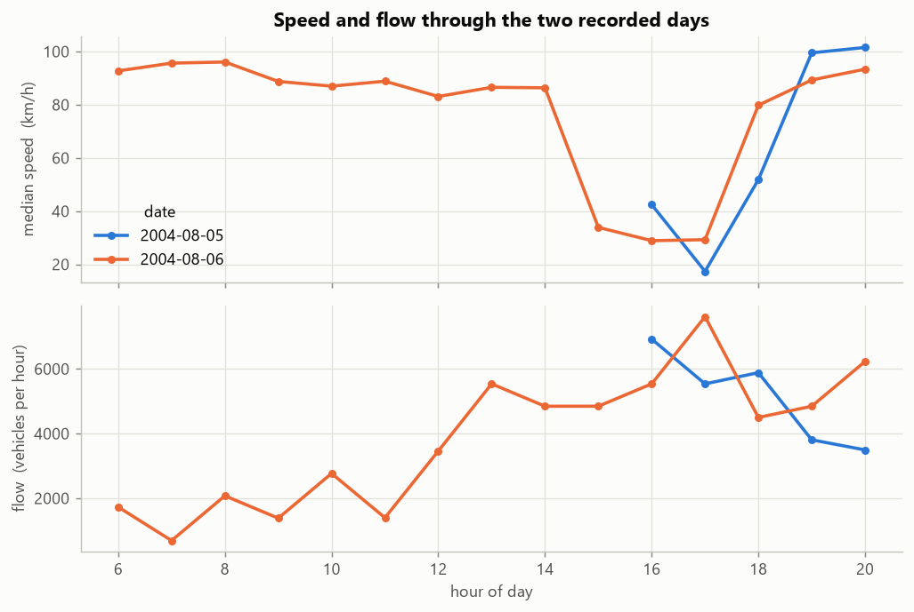
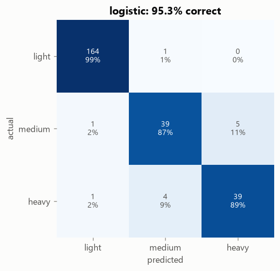
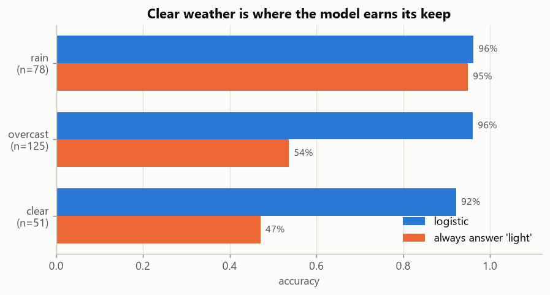

# Results

All numbers below come from the full dataset: 254 clips, analysed end to end, and scored
on the four evaluation folds the dataset ships with. Every figure is regenerated by
`python scripts/build_report.py`.

## The headline

**The congestion level is called correctly for 95.3% of clips (±1.5 across the four
folds), against 65.0% for a model that answers "light" every time.** The published work
on this dataset reports about 95%, so this matches it — with a different method, and with
every traffic parameter measured along the way.

| model | accuracy | spread across folds | macro-F1 |
|---|---|---|---|
| **logistic regression** (shipped) | **95.3%** | ±1.5 | **0.918** |
| gradient boosting | 93.7% | ±1.6 | 0.887 |
| traffic-engineering rules, no training | 82.7% | ±2.4 | 0.684 |
| always answer "light" | 65.0% | ±0.6 | 0.263 |

Macro-F1 scores the three levels equally. It matters here because 165 of the 254 clips
are light traffic. So plain accuracy mostly measures how well a model recognises an empty
road, and macro-F1 measures how well it catches congestion.

The rule model uses no training at all. It reads thresholds straight from the Highway
Capacity Manual. At 82.7% it shows the measurements carry the signal on their own; the
learned model adds the last 13 points.

---

## What was measured

The medians by the dataset's own label:

| | light | medium | heavy |
|---|---|---|---|
| clips | 165 | 45 | 44 |
| **space mean speed** | **90 km/h** | **42 km/h** | **22 km/h** |
| **density** (veh/km/lane) | **6.4** | **31.5** | **38.0** |
| occupancy (road area covered) | 4% | 20% | 31% |
| vehicles seen per clip | 10 | 33 | 35 |
| flow past the line (veh/h) | 3,062 | **7,157** | 5,127 |
| lane changes per vehicle | 0.09 | 0.13 | 0.17 |

In total the pipeline tracked **4,717 vehicles**: 3,061 cars, 1,511 trucks and 145 buses.

**This is the figure that shows the measurements are real.** Speed against density, one
point per clip, traces the classic curve traffic theory predicts — free speed on an empty
road, falling away as vehicles pack in. Nothing in the pipeline was built to produce this
curve. It appears because speed and density were measured independently, and correctly.

The three levels barely overlap on speed. Six clips have no traffic at all and are left
off: they have no speed to plot. They are reported as "not measured", not as 0 km/h —
see the notes at the end.

---

## What the traffic shows

### 1. Congestion destroys capacity, it does not just slow the road

**The road moves the most vehicles per hour in medium traffic — 7,157 — and 28% fewer
once it tips into heavy, 5,127.** A jammed road is not a busy road working hard; it is a
road that has lost a quarter of its throughput.

Flow rises with density up to the road's capacity, then falls as vehicles bunch and stop.

### 2. The road breaks down past about 16 vehicles per km per lane

The 95th percentile of density in free-flowing clips is **16.0**. The 5th percentile in
congested clips is **15.9**. They meet almost exactly — and 16 veh/km/lane is the Highway
Capacity Manual's boundary between level of service C and D. The data found the textbook
threshold on its own.

### 3. There is no stable middle

**Only 2 of the 248 clips with traffic run between 62 and 77 km/h.** The road is either
flowing at 77 km/h or more, or it has broken down below 62. It does not settle in between.
That gap is visible in the fundamental diagram above.

### 4. The PM peak: 15:00 to 18:00, worst at 17:00

| | median speed |
|---|---|
| 06:00 – 14:00 | 83 – 96 km/h, free-flowing |
| **15:00** | **34 km/h — the road breaks within the hour** |
| 16:00 – 17:00 | 29 km/h (6 Aug), down to 17 km/h (5 Aug) |
| 18:00 | 52 – 80 km/h, recovering |
| 19:00 – 20:00 | 89 – 101 km/h, free again |

The pattern repeats on both recorded days. (5 August was only recorded from 16:00, so its
morning is missing.) The camera faces southbound traffic leaving Seattle, so this is the
evening commute out of the city. The breakdown is abrupt: 86 km/h at 14:00 becomes 34 km/h
at 15:00.

### 5. Drivers hunt for faster lanes as it jams

Lane changes per vehicle nearly double, from 0.09 in light traffic to 0.17 in heavy. At the
same time the lanes fill evenly: lane imbalance falls from 0.39 to 0.17. On an empty road
drivers keep to a few lanes. In a jam every lane is full and drivers keep switching.

---

## Recommendations

For the Washington State DOT section of I-5 this camera covers:

1. **Act before 15:00, not at it.** The road breaks within an hour and does not flow freely
   again until 19:00. Ramp metering and variable speed limits should start around 14:30 on
   weekdays, while the road is still flowing.

2. **Watch density, not speed.** Speed gives no warning — it holds, then collapses. Density
   rises first. **On 6 August, between 13:00 and 14:00, density quadrupled from 3 to 14
   veh/km/lane while speed held at 86 km/h. An hour later the road had broken down.** A
   density alarm at about 16 veh/km/lane would have fired while there was still time to act.

3. **Keep the road out of "heavy" rather than trying to clear it.** Medium traffic moves 28%
   more vehicles than heavy. Holding the road at the edge of capacity beats letting it break
   and recovering later.

4. **Fix the lens.** Clips with water drops on the camera are 5% of the data but a third of
   all classification errors (4 of 12). A hood or a water-shedding lens coating is the
   cheapest accuracy gain available.

---

## Where it gets it wrong

| true level | caught |
|---|---|
| light | 164 of 165 (99.4%) |
| medium | 39 of 45 (86.7%) |
| heavy | 39 of 44 (88.6%) |

**Of the 12 mistakes, 11 are between neighbouring levels** — mostly medium called heavy
or the reverse. Those are borderline calls, and the labels were assigned by eye. Only one
jumps a level: a heavy clip called light, and it has water on the lens.

**Rain accuracy is not the good news it looks like.** 95% of the rain clips are light
traffic, so answering "light" every time already scores 95% in the rain. The model's 96%
there proves almost nothing. Clear weather is where it earns its keep: 92% against 47% for
guessing.

Lens-drop clips score 69% (9 of 13). None of them is light traffic, so guessing scores 0%.

The demo in [outputs/demos/](outputs/demos/) includes one of these on purpose:
`rain_cctv052x2004080615x00032.mp4` is heavy traffic that the model calls medium.

---

## How far to trust each number

| parameter | trust | why |
|---|---|---|
| congestion level | **high** | scored against the dataset's own labels, on clips the model never saw |
| relative speed | **high** | which clips are faster than which does not depend on any assumption |
| absolute speed | medium | rests on one assumption: free flow here is 100 km/h. See the README |
| density, occupancy | medium | understated in queues, where stopped vehicles overlap and get missed |
| lane changes, lane use | medium | lanes found from the traffic itself; boundary flicker is filtered out |
| flow (veh/h) | low | extrapolated from about five seconds of crossings per clip |
| vehicle class | low | COCO's "truck" includes pickups and large vans, so it is not a freight share |
| motorcycles | none | none detected in 254 clips; at 320×240 they are a few pixels wide |

---

## How the numbers were checked

- **Detection against hand counts.** Four frames were counted by eye, one per level plus
  one in the rain. Light and medium matched closely (10 against 11, 30 against 30). The
  heavy queue came out at 27 against 38. That undercount is why density is marked medium
  trust above.
- **Tests.** 50 tests cover the geometry, every metric, the classifiers, the evaluation and
  the dataset reader, including the corrupted first frame the dataset's README warns about.
- **Two measurement bugs were found and fixed before these numbers were produced.** First,
  one stationary false detection could drag a whole clip's speed to near zero — a light
  clip of eighteen vehicles once read 1.1 km/h. Speed is now total distance over total time,
  which cannot do that. Second, empty roads were reported as 0 km/h, which reads as a jam;
  they are now "not measured". Fixing both moved accuracy from 92.5% to 95.3%.
- **The second fix was applied without a full re-run.** It only changes clips with no
  measurable vehicle. This was proved rather than assumed: those six clips and six random
  controls were re-run through the real pipeline. The controls matched the stored numbers
  exactly, and the six changed only in their speed. The stored table is therefore
  identical to what `scripts/run_dataset.py` produces today.
